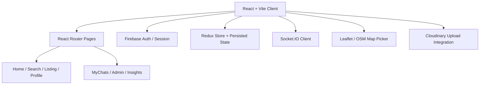
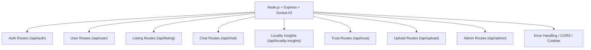
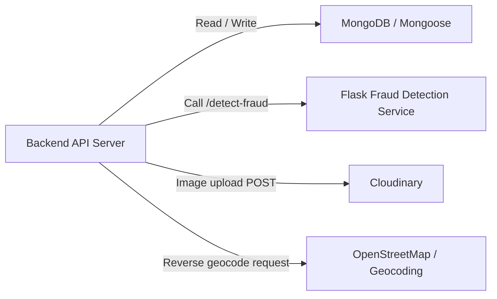

# Shelter Seeker

Shelter Seeker is a full-stack property marketplace built around real problems that show up in listing platforms: trust, moderation, locality context, and direct buyer-seller communication. The frontend is built with React and Vite, the main API layer runs on Node.js and Express, data is stored in MongoDB, listing search is cached with Redis, and fraud scoring is handled by a separate Flask service.

Instead of stopping at basic CRUD, the project includes map-based listing creation, Cloudinary-backed media uploads, seller trust scoring, locality insight aggregation, admin moderation, and real-time chat with Socket.IO.

## What It Covers

- Email/password authentication with JWT stored in HTTP-only cookies
- Google sign-in flow using Firebase on the client and backend session creation
- Property listing creation with map-based coordinate selection
- Reverse geocoding with OpenStreetMap / Nominatim to derive locality names
- Cloudinary image upload flow for listing media
- Locality insights based on seller ratings such as water, traffic, safety, schools, and daily needs
- Admin workflows for listing approval, user management, trust updates, and activity logs
- Real-time chat between buyer and seller using Socket.IO rooms
- Redis-backed caching for listing search
- Separate Flask fraud detection microservice called during listing workflows

## Tech Stack

- Frontend: React, Vite, React Router, Redux Toolkit, Redux Persist, Tailwind, Leaflet, Socket.IO Client, Firebase Auth
- Backend: Node.js, Express, MongoDB, Mongoose, Socket.IO, JWT, bcrypt, ioredis
- Services: Cloudinary, OpenStreetMap / Nominatim, Redis, Flask, scikit-learn model pickle

## Architecture

This is the current system view used for the repo.

## Frontend Architecture



## Backend Architecture



## Data & Service Integration



## How The Pieces Work Together

- The React client handles routing, forms, map interaction, image upload requests, locality views, admin screens, and chat UI.
- The Express server exposes REST APIs for auth, users, listings, trust, admin operations, uploads, and locality insights.
- Socket.IO is attached to the same HTTP server for live messaging and typing indicators.
- When a listing is created, the backend computes locality metadata, calls the fraud detection service, and stores the result with the listing.
- Listing search responses are cached in Redis to reduce repeated database work.

## Running Locally

### Prerequisites

- Node.js 18+
- Python 3.10+
- MongoDB
- Redis
- Docker Desktop is recommended for MongoDB and Redis, but native local installs work too

### 1. Start MongoDB and Redis

If you want the quickest setup, run both services with Docker:

```bash
docker run -d --name shelter-mongo -p 27017:27017 mongo:7
docker run -d --name shelter-redis -p 6379:6379 redis:7
```

If you already have MongoDB and Redis installed locally, that is fine too. Just make sure:

- MongoDB is reachable through the connection string you put in `server/.env`
- Redis is running on `localhost:6379`, because the backend currently connects there directly

### 2. Configure backend environment

Create `server/.env`:

```env
MONGO=mongodb://localhost:27017/shelterseeker
JWT_SECRET=replace_with_a_strong_secret
CLIENT_URL=http://localhost:5173
NODE_ENV=development

CLOUDINARY_CLOUD_NAME=your_cloud_name
CLOUDINARY_API_KEY=your_api_key
CLOUDINARY_API_SECRET=your_api_secret
```

Notes:

- `MONGO` can be a local URI or a MongoDB Atlas URI.
- Cloudinary is required for listing image uploads.

### 3. Configure frontend environment

Create `client/.env`:

```env
VITE_BACKEND_URL=http://localhost:3001
VITE_API_URL=http://localhost:3001

VITE_FIREBASE_API_KEY=your_firebase_key
VITE_FIREBASE_AUTH_DOMAIN=your_project.firebaseapp.com
VITE_FIREBASE_PROJECT_ID=your_project_id
VITE_FIREBASE_STORAGE_BUCKET=your_project.appspot.com
VITE_FIREBASE_MESSAGING_SENDER_ID=your_sender_id
VITE_FIREBASE_APP_ID=your_app_id
```

Notes:

- `VITE_BACKEND_URL` is used by parts of the client that call the backend directly.
- `VITE_API_URL` is used for Socket.IO.
- Google sign-in requires a working Firebase project configuration.

### 4. Install dependencies

Backend:

```bash
cd server
npm install
```

Frontend:

```bash
cd client
npm install
```

Fraud detection service:

```bash
cd fraud-detection-service
python -m venv .venv
```

On Windows:

```bash
.venv\Scripts\activate
```

On macOS/Linux:

```bash
source .venv/bin/activate
```

Then install the Python packages:

```bash
pip install flask numpy pandas scikit-learn
```

### 5. Run the app

Terminal 1: backend

```bash
cd server
npm run dev
```

Terminal 2: frontend

```bash
cd client
npm run dev
```

Terminal 3: fraud detection service

```bash
cd fraud-detection-service
python app.py
```

By default, the services run on:

- Frontend: `http://localhost:5173`
- Backend API + Socket.IO: `http://localhost:3001`
- Fraud detection service: `http://localhost:5005`

## Optional Admin Bootstrap

If you want an admin account for testing:

```bash
cd server
node createAdmin.js
```

Default admin created by the helper script:

- Email: `admin@shelterseeker.com`
- Password: `admin123`

You can also promote an existing user:

```bash
cd server
node promoteToAdmin.js user@example.com
```

## Project Structure

```text
Shelter-Seeker/
|-- client/                    # React + Vite frontend
|-- server/                    # Node.js + Express backend
|   |-- api/
|   |   |-- controller/
|   |   |-- model/
|   |   |-- routes/
|   |   |-- services/
|   |   `-- utils/
|   `-- redis.js
|-- fraud-detection-service/   # Flask microservice for fraud scoring
`-- ARCHITECTURE.md
```

## Notes

- The backend expects cookies to be enabled because auth uses an HTTP-only `access_token`.
- The Vite dev server already proxies `/api` requests to the backend.
- Locality data depends on valid map coordinates being sent with the listing.
- Fraud scoring is best-effort; if the Flask service is down, the backend still returns a fallback fraud result.

## Future Improvements

- Add Docker Compose for one-command local startup
- Add `.env.example` files for each service
- Add automated tests around chat, locality aggregation, and trust workflows
- Add deployment guides for production environments
